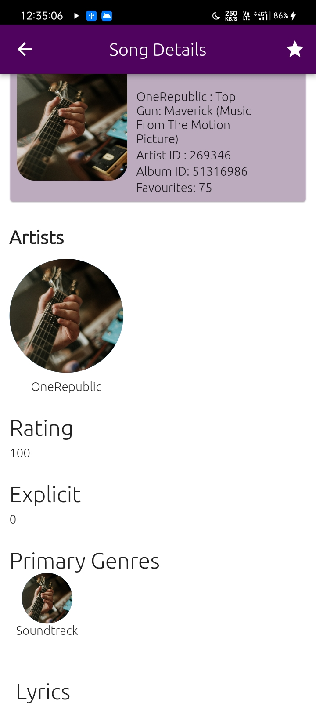
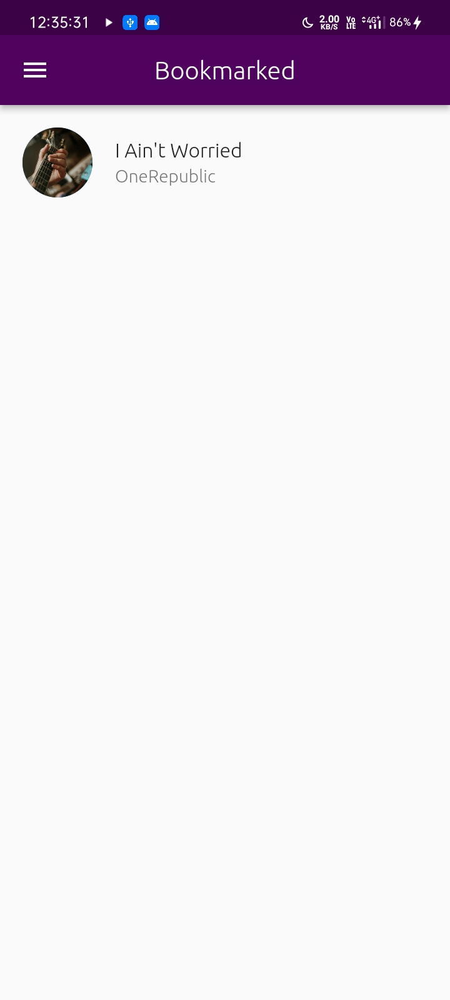

# credicxo_music_app
A new Flutter project.

## Screenshots

## Features

* User can view the trending songs that are fetched via musicmax api
* User can view various details and lyrics of choosen songs
* User can bookmarks songs for later viewing which is saved in the hive db in local storage

## Getting Started

Demo Project
